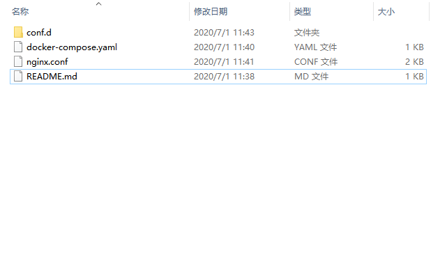

# Docker快速部署Nginx脚本

**目录结构**




```txt
conf.d		站点配置文件目录
docker-compose.yaml    Docker compose脚本
nginx.conf    Nginx全局配置文件
```

**新增站点在conf.d目录下新建站点如www.baidu.com.conf文件把default.conf内的配置COPY过来即可**

**启动**

在根目录下执行shell命令：

启动命令：

	docker-compose up -d

	docker-compose down

	docker-compose stop

	docker-compose start

	docker-compose restart
